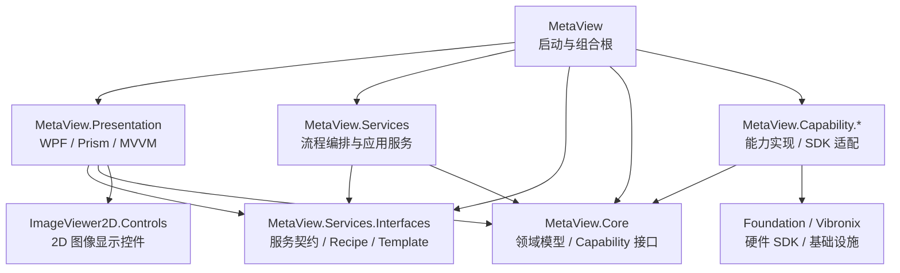
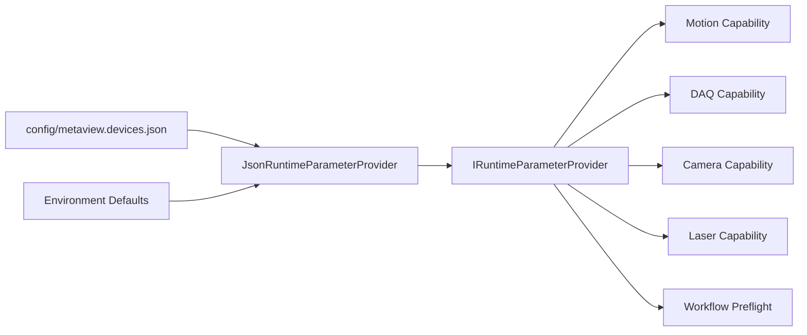
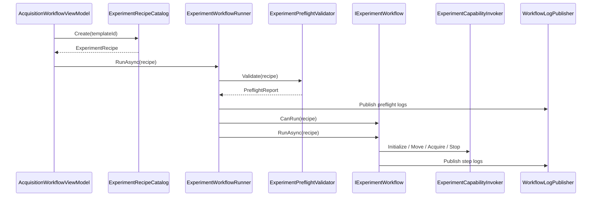
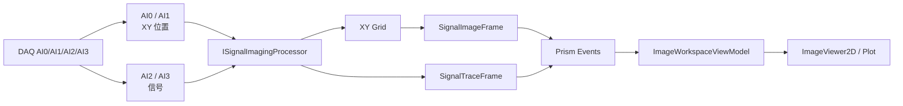
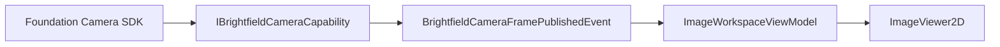
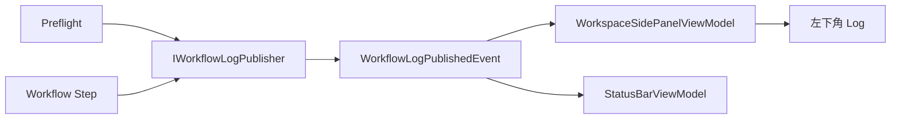

# MetaView 当前软件结构与流程说明

## 1. 软件定位

MetaView 定位为通用光谱成像平台，面向 1D、2D、3D、4D 等多维采集流程，以及 SRS、Brightfield、Fluorescence、TPEF、CARS、DC 等多模态成像或光谱技术。

当前平台的核心目标是：

- 用 WPF + Prism + MVVM 构建可扩展的桌面软件外壳。
- 用五层结构隔离 UI、流程、领域模型、能力实现和基础设施 SDK。
- 让不同运动控制器、DAQ、相机、激光器、探测器可以通过 Capability 层接入。
- 让不同技术路线通过 Recipe + Workflow 扩展，而不是在界面或主程序里写死。
- 保持“大道至简”：少建包装层，边界清楚，命名能直接表达职责。

## 2. 五层结构



### 2.1 MetaView

主程序层，是 Prism 组合根。

主要职责：

- 创建和配置 Prism 容器。
- 注册 Capability、Services、Presentation ViewModel。
- 注册 Prism Region。
- 加载运行参数 provider。
- 打开主窗口。

关键文件：

- `MetaView/App.xaml.cs`
- `MetaView/Composition/MetaViewContainerRegistration.cs`

### 2.2 MetaView.Presentation

表现层，负责界面和用户交互。

主要职责：

- WPF View / ViewModel。
- ImageDisplay、Signal 曲线、Stage Motion、Log、Status 等 UI。
- 通过命令调用服务层入口。
- 订阅 Prism Event 展示图像、信号、日志和状态。

表现层不直接依赖 Foundation SDK，也不直接编排硬件流程。

### 2.3 ImageViewer2D.Controls

`ImageViewer2D.Controls` 是 MetaView 当前使用的 2D 图像显示控件源码工程，已经替代原先 `MetaView.Presentation/Lib/ImageViewer2D.Controls.dll` 二进制引用。

主要职责：

- 显示 2D 图像。
- 支持缩放、平移和导航缩略图。
- 支持 ROI 绘制、选择、移动和缩放。
- 支持 Crosshair。
- 输出鼠标位置、图像坐标、ROI 等交互事件。

`MetaView.Presentation` 通过 `ProjectReference` 引用该控件工程。XAML 中仍使用原控件命名空间：

```xml
xmlns:viewer="clr-namespace:ImageViewer2D.Controls;assembly=ImageViewer2D.Controls"
```

### 2.4 MetaView.Services.Interfaces

服务契约层，放置服务层对外模型和接口。

当前主要内容：

- `IExperimentWorkflow`
- `IExperimentWorkflowRunner`
- `IExperimentCapabilityInvoker`
- `IExperimentPreflightValidator`
- `ExperimentRecipeCatalog`
- `ExperimentRecipeTemplate`
- `DemoExperimentRecipes`
- `WorkflowLogPublishedEvent`
- `SignalImageFramePublishedEvent`
- `SignalTraceFramePublishedEvent`

### 2.5 MetaView.Services

服务实现层，负责编排实验流程，不直接引用具体硬件 SDK。

当前主要内容：

- `ExperimentWorkflowRunner`
- `ExperimentPreflightValidator`
- `ExperimentCapabilityInvoker`
- `WorkflowLogPublisher`
- `RealtimeSignalImagingService`
- `SrsTwoDDemoWorkflow`
- `MultimodalImagingWorkflow`

### 2.6 MetaView.Core

核心领域层，定义跨层共享的领域模型和能力接口。

当前主要领域：

- `MotionControl`
- `DataAcquisition`
- `Imaging`
- `Algorithms`
- `Experiments`
- `Parameters`
- `Laser`
- `PhotoDetection`
- `Reporting`

Core 应尽量保持纯净。当前 Core 中仍有 Prism Event 类型，这是历史遗留和当前兼容选择，后续可再迁移。

### 2.7 MetaView.Capability.*

能力实现层，负责把 Core 中的能力接口落到真实实现或 Demo 实现。

当前能力工程：

- `MetaView.Capability.MotionControl`
- `MetaView.Capability.DaqAndPreprocessing`
- `MetaView.Capability.ImageAcquisition`
- `MetaView.Capability.AlgorithmProcessing`
- `MetaView.Capability.ParameterManagement`
- `MetaView.Capability.LaserSource`
- `MetaView.Capability.PhotoDetect`
- `MetaView.Capability.ReportManagement`

Capability 层可以引用 Foundation，但不能引用 Presentation。

## 3. 当前目录结构

```text
MetaView
|-- config
|   `-- metaview.devices.json
|
|-- docs
|   `-- MetaView_当前软件结构与流程说明.md
|
|-- MetaView
|   |-- App.xaml.cs
|   `-- Composition
|       `-- MetaViewContainerRegistration.cs
|
|-- MetaView.Presentation
|   |-- Views
|   |-- ViewModels
|   |-- Services
|   |-- Core
|   `-- Themes
|
|-- ImageViewer2D.Controls
|   |-- ImageViewer2D.cs
|   |-- Models
|   `-- Themes
|
|-- MetaView.Services.Interfaces
|   |-- IExperimentWorkflow.cs
|   |-- IExperimentWorkflowRunner.cs
|   |-- IExperimentCapabilityInvoker.cs
|   |-- IExperimentPreflightValidator.cs
|   |-- ExperimentRecipeCatalog.cs
|   |-- ExperimentRecipeTemplate.cs
|   `-- DemoExperimentRecipes.cs
|
|-- MetaView.Services
|   |-- ExperimentWorkflowRunner.cs
|   |-- ExperimentPreflightValidator.cs
|   |-- ExperimentCapabilityInvoker.cs
|   |-- RealtimeSignalImagingService.cs
|   |-- WorkflowLogPublisher.cs
|   `-- Workflows
|       |-- ExperimentWorkflowBase.cs
|       |-- SrsTwoDDemoWorkflow.cs
|       `-- MultimodalImagingWorkflow.cs
|
|-- MetaView.Core
|   |-- Experiments
|   |-- MotionControl
|   |-- DataAcquisition
|   |-- Imaging
|   |-- Algorithms
|   |-- Parameters
|   |-- Laser
|   |-- PhotoDetection
|   `-- Reporting
|
`-- MetaView.Capability.*
```

## 4. 依赖原则

推荐依赖方向：

```text
Presentation -> Services.Interfaces -> Core
Services     -> Services.Interfaces -> Core
Capability   -> Core -> Foundation
MetaView     -> 全部工程，仅用于启动和注册
```

约束：

- Core 不依赖 Services、Presentation、Capability。
- Services 不依赖具体 Capability 工程，只依赖 Core 能力接口。
- Presentation 不直接引用 Foundation SDK。
- Workflow 不直接调用具体厂商 SDK。
- Capability 不引用 Presentation。
- 设备 SDK 不穿透到 ViewModel。

## 5. 设备配置

### 5.1 配置文件

当前默认设备配置文件：

- `config/metaview.devices.json`

主程序通过 `JsonRuntimeParameterProvider` 加载设备参数。

加载策略：

- 优先从应用输出目录读取 `config/metaview.devices.json`。
- 如果输出目录不存在该文件，则从当前工作目录读取。
- 如果文件不存在或某个配置段缺失，则回退到原来的环境变量默认值。

当前配置覆盖：

- `motionSystem`
- `daq`
- `brightfieldCamera`
- `laser`

### 5.2 配置链路



### 5.3 多运动控制器

运动系统通过以下模型描述：

- `MotionSystemConfiguration`
- `MotionControllerEndpoint`
- `MotionAxisBinding`
- `MotionAxis`

设计含义：

- 一个系统可以配置多个物理控制器。
- 每个控制器有独立的类型、端口、IP、超时、轴数和模块名称。
- 逻辑轴 X/Y/Z 通过 `MotionAxisBinding` 映射到具体控制器和物理轴。
- Workflow 和 UI 只使用逻辑轴，不关心具体控制器。

## 6. 主要能力接口

### 6.1 Motion

接口：

- `IMotionControlCapability`

职责：

- 初始化。
- Home。
- 相对运动。
- 绝对运动。
- 停止。
- 状态查询和监控。

当前实现：

- `DemoMotionControlCapability`
- `CompositeMotionControlCapability`

### 6.2 DAQ 与信号成像

接口：

- `IDataAcquisitionCapability`
- `ISignalImagingProcessor`

职责：

- 配置 DAQ。
- 启动和停止采集。
- 接收 AI0、AI1、AI2、AI3 四路信号。
- 使用 AI0、AI1 作为 XY 位置。
- 使用 AI2、AI3 作为信号数据。
- 按 XY 网格分组、聚合、归一化并生成图像。
- 同步发布四路信号曲线。

### 6.3 Brightfield Camera

接口：

- `IBrightfieldCameraCapability`

职责：

- 相机枚举。
- 初始化。
- 参数应用。
- Live。
- 单帧采集。
- 图像帧发布到 ImageDisplay。

### 6.4 Algorithm

接口：

- `IAlgorithmProcessingCapability`

职责：

- 帧平均。
- 阴影校正。
- 光谱特征提取。
- ROI 统计。
- 峰值图生成。
- 灰度预览转换。
- Tile Grid 规划。

### 6.5 Laser / PhotoDetection / Reporting

接口：

- `ILaserControlCapability`
- `IPhotoDetectionCapability`
- `IReportGenerationCapability`

当前状态：

- 接口边界已建立。
- Capability 层已有占位实现。
- 后续可逐步接入真实 Foundation SDK。

## 7. Recipe 与 Workflow

### 7.1 配方模型

核心模型：

- `ExperimentRecipe`
- `CapabilityPlan`
- `ModalityPlan`
- `ExperimentCapability`
- `ScanPlan`
- `ProcessingPlan`
- `SavePlan`

设计意图：

- `ExperimentRecipe` 描述一次实验。
- `CapabilityPlan` 描述需要哪些平台能力。
- `ModalityPlan` 描述多模态实验中的一个子模态。
- `Workflow` 负责解释 Recipe 并编排能力调用。

单模态配方示意：

```text
ExperimentRecipe: SRS 2D
|-- Dimension: TwoD
|-- Modality: Srs
|-- ScanPlan: Raster 100 x 100
|-- ProcessingPlan: SignalImage
`-- CapabilityPlan: Motion + DAQ + SignalImaging + Algorithm
```

多模态配方示意：

```text
ExperimentRecipe: SRS + Brightfield 2D
|-- Modality: Multimodal
|-- ModalityPlan: SRS 2D
|   `-- CapabilityPlan: Motion + DAQ + SignalImaging + Algorithm
|
`-- ModalityPlan: Brightfield 2D
    `-- CapabilityPlan: BrightfieldCamera
```

### 7.2 配方模板库

当前内置模板由 `ExperimentRecipeCatalog` 管理。

已有模板：

- `template.srs.2d`
- `template.brightfield.2d`
- `template.srs-brightfield.2d`

UI Demo 按钮不再直接构造具体 Demo Recipe，而是通过模板 ID 创建 Recipe。

### 7.3 Workflow Runner

接口：

- `IExperimentWorkflowRunner`

职责：

- 接收 Recipe。
- 执行预检。
- 选择匹配的 `IExperimentWorkflow`。
- 执行 Workflow。

当前实现：

- `ExperimentWorkflowRunner`

### 7.4 Workflow 预检

接口：

- `IExperimentPreflightValidator`

当前实现：

- `ExperimentPreflightValidator`

预检内容：

- RecipeId 是否为空。
- ScanPlan 尺寸是否有效。
- 多模态子计划是否有稳定的 ModalityId。
- Motion 参数是否存在。
- 非 Demo Motion 是否有控制器和轴绑定。
- DAQ 参数是否存在。
- 非 Demo DAQ 是否有配置文件路径。
- Brightfield Camera 参数是否存在。
- Laser 参数是否存在。

预检结果会输出到界面 Log：

- 非阻断项：信息日志。
- 阻断项：错误日志，并停止执行 Workflow。

### 7.5 Capability Invoker

接口：

- `IExperimentCapabilityInvoker`

当前实现：

- `ExperimentCapabilityInvoker`

职责：

- 根据 `CapabilityPlan` 初始化所需能力。
- 根据 `CapabilityPlan` 停止需要收尾的能力。
- 为 Workflow 提供统一能力调用入口。
- 隐藏具体 Capability 实现和 Foundation SDK。

## 8. 当前流程

### 8.1 Demo 按钮流程



### 8.2 SRS 2D Demo Workflow

当前 `SrsTwoDDemoWorkflow` 步骤：

1. 验证 Recipe。
2. 初始化 Recipe 所需能力。
3. 发布 Signal Preview。
4. X 相对运动。
5. Y 相对运动。
6. Z 相对运动。
7. 启动 DAQ。
8. 采集 DAQ 数据并发布信号图像。
9. 停止 Recipe 所需能力。

### 8.3 多模态 Workflow

当前 `MultimodalImagingWorkflow` 处理 `ImagingModality.Multimodal` 配方。

执行方式：

1. 验证总配方。
2. 遍历 `ExperimentRecipe.EffectiveModalities`。
3. 对每个 `ModalityPlan` 初始化能力。
4. 按模态类型执行动作。
5. 记录数据产品。
6. 停止该模态需要收尾的能力。

当前支持：

- SRS。
- Brightfield。
- Fluorescence / TPEF 的探测器占位流程。
- CARS / DC 走信号采集类流程。

## 9. 图像与信号链路

### 9.1 四路 DAQ 信号成像



### 9.2 明场相机图像



## 10. 日志链路



设计原则：

- Workflow 只发布流程语义日志。
- ViewModel 只订阅并展示日志。
- UI 控件对象不传入服务层。

## 11. Prism Region

当前主界面使用 Prism Region 组织模块。

典型区域：

- `TopBar`
- `Navigation`
- `Workspace`
- `Hardware`
- `Acquisition`
- `Status`

价值：

- 后续可以替换不同 Workspace。
- 可以按模块加载设备控制面板。
- 可以保留统一外壳并切换风格。
- 适合多人并行开发不同区域。

## 12. 扩展指南

### 12.1 新增设备

推荐步骤：

1. 优先确认是否属于已有 Core Capability 接口。
2. 在对应 Capability 工程中新增适配实现。
3. 如果只是设备参数不同，优先修改 `config/metaview.devices.json`。
4. 如果需要替换实现，在组合根中调整 DI 注册。
5. 不修改 UI 和 Workflow 主干。

### 12.2 新增运动控制器

推荐步骤：

1. 在 `metaview.devices.json` 中新增 `MotionControllerEndpoint`。
2. 配置逻辑轴到物理轴的 `MotionAxisBinding`。
3. 如 Foundation 已支持该控制器，在 `CompositeMotionControlCapability` 中补充创建逻辑。
4. Workflow 继续使用 `MotionAxis.X/Y/Z`。

### 12.3 新增技术路线

推荐步骤：

1. 建立或复用 `ExperimentRecipe`。
2. 定义需要的 `CapabilityPlan`。
3. 如为多模态，添加多个 `ModalityPlan`。
4. 新增或复用 `IExperimentWorkflow`。
5. 添加 `ExperimentRecipeCatalog` 模板。
6. 注册 Workflow。

### 12.4 新增模板

推荐步骤：

1. 在 `ExperimentRecipeCatalog` 中增加模板 ID。
2. 创建 `ExperimentRecipeTemplate`。
3. 通过 `DemoExperimentRecipes` 或后续真实 Recipe Factory 创建 Recipe。
4. UI 只选择模板，不直接拼 Recipe。

## 13. 当前边界

当前已完成：

- WPF + Prism + MVVM 平台壳。
- 五层结构主干。
- 设备 JSON 配置入口。
- Workflow 预检。
- 配方模板库。
- SRS 2D Demo Workflow。
- SRS + Brightfield 多模态 Workflow。
- Motion / DAQ / Camera / Algorithm 等能力接口和部分实现。

仍需后续完善：

- 真实设备配置 UI。
- 配置文件保存和热更新。
- Laser / PhotoDetection / Reporting 的真实 SDK 接入。
- 真实 DAQ 数据驱动的完整采集闭环。
- Workflow 测试工程。
- Core 中 Prism Event 的进一步解耦。
- 当前本机环境存在 `obj/cache` 写入权限问题，完整 build 需要在权限正常环境下重新验证。

## 14. 开发约定

建议团队遵守：

- 能力接口放 Core。
- 设备接入放 Capability。
- 流程编排放 Services。
- 服务契约、Recipe、Template 放 Services.Interfaces。
- UI 状态和命令放 Presentation ViewModel。
- 启动、DI、Region 注册放 MetaView 主程序。
- 不为简单转发创建新服务。
- 不让硬件 SDK 穿透到 ViewModel。
- 不让 Workflow 依赖具体 Capability 工程。
- 新流程优先新增 `IExperimentWorkflow`。
- 新实验入口优先新增 `ExperimentRecipeTemplate`。
- 命名要能看出领域含义，例如 Motion、Daq、Imaging、Algorithm、Workflow、Recipe、Capability、Preflight、Template。

## 15. 总结

MetaView 当前已经形成“通用光谱成像平台”的基础骨架：设备配置通过 JSON 进入参数 provider，实验意图通过 Recipe 和 Template 表达，Workflow Runner 先预检再选择流程，Workflow 通过 Capability Invoker 调用平台能力，Capability 层再适配 Foundation 或 Demo 实现。

后续继续扩展时，应优先沿着这条链路补充能力，而不是在 UI 或主程序里硬编码具体实验逻辑。
