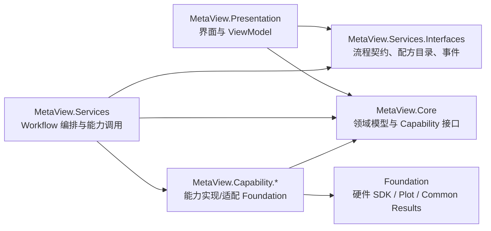
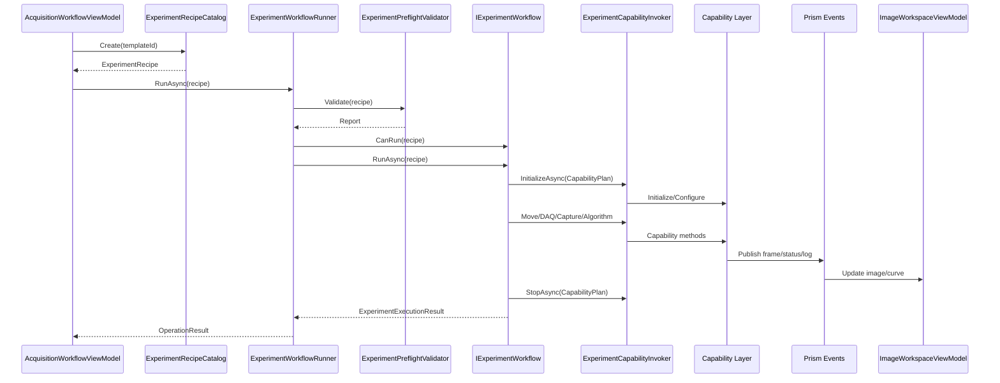

# MetaView 流程配置与运行代码结构

本文整理当前 MetaView 中“流程配方如何配置、如何选择 Workflow、如何调用 Capability、如何反馈到界面”的代码结构。当前实现是可运行 Demo 架构，已经具备单模态 SRS、明场相机、SRS + 明场多模态流程骨架。

## 1. 总体分层



核心原则：

- `Core` 定义领域类型和能力接口，不依赖 UI 和具体 SDK。
- `Services.Interfaces` 定义流程运行契约、事件和内置配方入口。
- `Services` 只负责编排，不直接写硬件 SDK 细节。
- `Capability.*` 负责把平台接口适配到 Foundation 或 Demo。
- `Presentation` 只触发流程和显示结果，不直接操作具体设备类。

## 2. 配方模型

配方定义在 `MetaView.Core/Experiments`。

| 类型 | 文件 | 作用 |
| --- | --- | --- |
| `ExperimentRecipe` | `MetaView.Core/Experiments/ExperimentRecipe.cs` | 一个可执行实验的总描述 |
| `ModalityPlan` | `MetaView.Core/Experiments/ModalityPlan.cs` | 多模态流程中的一个模态 |
| `CapabilityPlan` | `MetaView.Core/Experiments/CapabilityPlan.cs` | 本流程需要哪些能力 |
| `ScanPlan` | `MetaView.Core/Experiments/ScanPlan.cs` | X/Y/Z/T 扫描维度、点数、步长、扩展参数 |
| `ProcessingPlan` | `MetaView.Core/Experiments/ProcessingPlan.cs` | 输入通道和处理模式 |
| `SavePlan` | `MetaView.Core/Experiments/SavePlan.cs` | 保存路径、名称、数据产品类型 |

`ExperimentRecipe` 的结构是：

```csharp
ExperimentRecipe(
    RecipeId,
    Dimension,
    Modality,
    ScanPlan,
    ProcessingPlan,
    SavePlan,
    Metadata,
    Modalities,
    CapabilityPlan)
```

单模态流程：

- `Modalities == null`
- `ExperimentRecipe.EffectiveModalities` 会自动把自身转换成一个 `ModalityPlan`

多模态流程：

- `Modalities` 中包含多个 `ModalityPlan`
- 每个模态有自己的 `ScanPlan`、`ProcessingPlan`、`CapabilityPlan`

## 3. 内置配方入口

内置配方在 `MetaView.Services.Interfaces`。

| 文件 | 作用 |
| --- | --- |
| `ExperimentRecipeCatalog.cs` | 内置配方目录，按 template id 创建配方 |
| `DemoExperimentRecipes.cs` | 构造 Demo 配方对象 |
| `ExperimentRecipeTemplate.cs` | 模板元数据 |

当前模板：

```csharp
ExperimentRecipeCatalog.SrsTwoDTemplateId
ExperimentRecipeCatalog.BrightfieldTwoDTemplateId
ExperimentRecipeCatalog.SrsBrightfieldTwoDTemplateId
```

当前 Demo 配方示例：

- `CreateSrsTwoD(...)`
- `CreateBrightfieldTwoD()`
- `CreateSrsBrightfieldTwoD(...)`

SRS 2D 配方的关键参数：

```csharp
ScanPlan.Parameters:
  XRelativeDistance
  YRelativeDistance
  ZRelativeDistance
  DaqAcquireMilliseconds

ProcessingPlan:
  Mode = SignalImage
  InputChannels = AI0, AI1, AI2, AI3
  PositionXChannel = AI0
  PositionYChannel = AI1
  SignalChannels = AI2,AI3

CapabilityPlan:
  Motion
  DataAcquisition
  SignalImaging
  Algorithm
```

SRS + 明场多模态配方：

```csharp
ExperimentRecipe.Modality = Multimodal
ExperimentRecipe.Modalities =
  srs:
    CapabilityPlan = Motion + DataAcquisition + SignalImaging + Algorithm
  brightfield:
    CapabilityPlan = BrightfieldCamera
```

## 4. UI 如何触发流程

入口在：

```text
MetaView.Presentation/ViewModels/AcquisitionWorkflowViewModel.cs
```

主要命令：

| 命令 | 触发按钮 | 作用 |
| --- | --- | --- |
| `LivePreviewCommand` | Live | 初始化明场相机并开启实时采集 |
| `SingleCaptureCommand` | Capture | 初始化明场相机并采一帧 |
| `RunDemoWorkflowCommand` | Demo | 根据当前模态创建内置配方并运行 Workflow |
| `AbortCommand` | Abort | 停止 Live 或取消流程 |

Demo 按钮核心逻辑：

```csharp
var templateId = SelectedModality == ImagingModality.Multimodal
    ? ExperimentRecipeCatalog.SrsBrightfieldTwoDTemplateId
    : ExperimentRecipeCatalog.SrsTwoDTemplateId;

await _workflowRunner.RunAsync(
    ExperimentRecipeCatalog.Create(templateId),
    _acquisitionCts.Token);
```

也就是说：

- UI 不直接 new Workflow。
- UI 只选择模板 id。
- 模板创建 `ExperimentRecipe`。
- `IExperimentWorkflowRunner` 根据配方选择合适 Workflow。

## 5. Workflow Runner

入口：

```text
MetaView.Services/ExperimentWorkflowRunner.cs
```

职责：

1. 调用 `IExperimentPreflightValidator.Validate(recipe)` 做运行前检查。
2. 在注册的 `IExperimentWorkflow` 集合里查找 `CanRun(recipe) == true` 的 workflow。
3. 执行该 workflow。

伪代码：

```csharp
preflight = Validate(recipe)
if (!preflight.CanRun) return Error

workflow = workflows.FirstOrDefault(x => x.CanRun(recipe))
if (workflow == null) return Error

return await workflow.RunAsync(recipe)
```

Workflow 注册位置：

```text
MetaView/Composition/MetaViewContainerRegistration.cs
```

当前注册：

```csharp
containerRegistry.Register<IExperimentWorkflow, SrsTwoDDemoWorkflow>();
containerRegistry.Register<IExperimentWorkflow, MultimodalImagingWorkflow>();
containerRegistry.Register<IExperimentWorkflowRunner, ExperimentWorkflowRunner>();
```

## 6. Preflight 运行前检查

文件：

```text
MetaView.Services/ExperimentPreflightValidator.cs
```

检查内容：

- `RecipeId` 是否为空。
- `ScanPlan.SizeX/Y/Z/T` 是否为正数。
- 多模态中每个 `ModalityId` 是否稳定存在。
- Motion 是否有控制器和轴绑定。
- DAQ 是否有配置路径。
- Brightfield 是否有相机类型。
- Laser 是否有激光类型。

检查结果通过 `IWorkflowLogPublisher` 发布到左下角 Log。

## 7. Workflow 基类与步骤执行

基类：

```text
MetaView.Services/Workflows/ExperimentWorkflowBase.cs
```

它把 Workflow 标准化成 Step 列表：

```csharp
foreach (var step in BuildSteps(recipe))
{
    log: step started
    result = await step.ExecuteAsync(context, token)
    records.Add(...)
    log: step completed/failed
    if failed return Error
}
```

运行上下文：

```text
MetaView.Services/Workflows/WorkflowExecutionContext.cs
```

当前保存：

- `Recipe`
- `DataProducts`

执行记录：

```text
MetaView.Core/Experiments/ExperimentStepRecord.cs
MetaView.Core/Experiments/ExperimentExecutionResult.cs
MetaView.Core/Experiments/ExperimentDataProduct.cs
```

## 8. 单模态 SRS 2D Workflow

文件：

```text
MetaView.Services/Workflows/SrsTwoDDemoWorkflow.cs
```

适配条件：

```csharp
recipe.Dimension == TwoD
recipe.Modality == Srs
recipe.ProcessingPlan.Mode == SignalImage
```

当前步骤顺序：

```text
validate.recipe
capabilities.initialize
publish.preview
motion.move.x
motion.move.y
motion.move.z
daq.start
daq.acquire
capabilities.stop
```

关键调用：

```csharp
capabilityInvoker.InitializeAsync(recipe.EffectiveCapabilityPlan)
capabilityInvoker.PublishSignalPreview(grid)
capabilityInvoker.MoveRelativeAsync(MotionAxis.X, ...)
capabilityInvoker.MoveRelativeAsync(MotionAxis.Y, ...)
capabilityInvoker.MoveRelativeAsync(MotionAxis.Z, ...)
capabilityInvoker.StartDaqAsync()
capabilityInvoker.AcquireDaqAsync(...)
capabilityInvoker.StopAsync(recipe.EffectiveCapabilityPlan)
```

目前 `AcquireDaqAsync` 是 Demo 行为：

- 延时模拟采集。
- 调用 `RealtimeSignalImagingService.ProcessDemoFrame(grid)` 生成图像和四路曲线。

## 9. 多模态 Workflow

文件：

```text
MetaView.Services/Workflows/MultimodalImagingWorkflow.cs
```

适配条件：

```csharp
recipe.Modality == Multimodal
recipe.EffectiveModalities.Count > 0
```

执行结构：

```text
validate.recipe
modality.srs
modality.brightfield
...
```

每个模态独立执行：

```csharp
InitializeAsync(modality.CapabilityPlan)
Run by modality type
StopAsync(modality.CapabilityPlan)
```

当前模态映射：

| Modality | 执行函数 |
| --- | --- |
| `Srs` | `RunSrsAsync` |
| `Cars` | `RunSrsAsync` |
| `Dc` | `RunSrsAsync` |
| `Brightfield` | `RunBrightfieldAsync` |
| `Fluorescence` | `RunPhotoDetectionAsync` |
| `Tpef` | `RunPhotoDetectionAsync` |

这说明目前多模态已经有框架，但具体 TPEF/CARS/DC 的真实采集动作还需要后续细化。

## 10. Capability 调用适配器

文件：

```text
MetaView.Services/ExperimentCapabilityInvoker.cs
```

这是 Workflow 和 Capability 的中间层，Workflow 不直接依赖具体能力实现。

它注入：

```csharp
IMotionControlCapability
IDataAcquisitionCapability
IBrightfieldCameraCapability
ILaserControlCapability
IPhotoDetectionCapability
IAlgorithmProcessingCapability
IRealtimeSignalImagingService
IRuntimeParameterProvider
```

主要职责：

- 按 `CapabilityPlan.Required` 初始化能力。
- 读取参数层配置。
- 调用具体 Capability 接口。
- 停止需要关闭的能力。

初始化映射：

| Capability | 调用 |
| --- | --- |
| `Motion` | `motionControlCapability.InitializeAsync()` |
| `DataAcquisition` | 读取 DAQ 配置后 `ConfigureAsync()` |
| `BrightfieldCamera` | 读取相机参数后 `InitializeAsync()` |
| `Laser` | 读取激光参数后 `InitializeAsync()` |
| `PhotoDetection` | `photoDetectionCapability.InitializeAsync()` |
| `Algorithm` | `RunAlgorithmPreview()` |
| `SignalImaging` | 事件驱动，返回 OK |

停止映射：

| Capability | 调用 |
| --- | --- |
| `DataAcquisition` | `StopAsync()` |
| `BrightfieldCamera` | `StopLiveAsync()` |
| `Laser` | `SetEmissionAsync(false)` |
| `Motion` | `StopAsync()` |

## 11. 参数配置

参数统一入口：

```text
MetaView.Core/Parameters/IRuntimeParameterProvider.cs
```

JSON Provider：

```text
MetaView.Capability.ParameterManagement/Providers/JsonRuntimeParameterProvider.cs
```

配置文件：

```text
config/metaview.devices.json
```

当前配置包括：

- `motionSystem`
- `daq`
- `brightfieldCamera`
- `imageStageNavigation`
- `laser`

例如 Motion 当前是 Demo：

```json
"motionSystem": {
  "useDemo": true,
  "controllers": [...],
  "axisBindings": [...]
}
```

如果未来要启用真实运控：

```json
"useDemo": false
```

然后配置对应：

- `controllerType`: `Pusi` / `Kaifull` / `Prior` / `ZMotionEthernet` / `HeidStarGclib` / `E53XMT`
- `portName`
- `baudRate`
- `ipAddress`
- `axisBindings`

## 12. 结果反馈到界面

### Log

Workflow 通过：

```text
MetaView.Services/WorkflowLogPublisher.cs
MetaView.Services.Interfaces/WorkflowLogPublishedEvent.cs
```

发布日志。

UI 侧订阅后显示在左下角 Log 列表。

### 图像

SRS/DAQ Demo 图像：

```text
MetaView.Services/RealtimeSignalImagingService.cs
```

发布：

```text
SignalImageFramePublishedEvent
SignalTraceFramePublishedEvent
```

明场相机图像：

```text
BrightfieldCameraFramePublishedEvent
```

UI 侧：

```text
MetaView.Presentation/ViewModels/ImageWorkspaceViewModel.cs
```

订阅这些事件，并更新：

- `LiveImageSource`
- `SignalPlotChartId`
- AI0/AI1/AI2/AI3 曲线数据

最终显示在：

```text
MetaView.Presentation/Views/ImageWorkspaceView.xaml
```

其中图像控件是：

```xml
<viewer:ImageViewer2D Source="{Binding LiveImageSource}" ... />
```

## 13. 当前流程调用链



## 14. 如何新增一个流程

推荐步骤：

1. 在 `MetaView.Core/Experiments` 确认是否已有需要的枚举：
   - `ImagingModality`
   - `AcquisitionDimension`
   - `ProcessingMode`
   - `ExperimentCapability`

2. 在 `DemoExperimentRecipes` 或新的配方工厂中创建 `ExperimentRecipe`。

3. 在 `ExperimentRecipeCatalog` 中注册模板 id。

4. 如果是新流程类型，新增一个 Workflow：

```text
MetaView.Services/Workflows/<Name>Workflow.cs
```

实现：

```csharp
WorkflowId
CanRun(recipe)
BuildSteps(recipe)
```

5. 在 `MetaViewContainerRegistration.RegisterApplicationServices()` 注册：

```csharp
containerRegistry.Register<IExperimentWorkflow, NewWorkflow>();
```

6. 如果需要新的设备能力：
   - 在 `MetaView.Core` 定义接口和领域类型。
   - 在 `MetaView.Capability.*` 实现接口。
   - 在 `ExperimentCapabilityInvoker` 中增加初始化/停止/调用方法。
   - 在 `CapabilityPlan.Required` 中声明该能力。

## 15. 当前仍需完善的点

当前架构已经能跑 Demo，但还不是完整生产流程：

- 真实 DAQ 采集目前多数路径仍是 Demo frame。
- 多模态中 TPEF/CARS/DC 目前共用 SRS 或 PhotoDetection 占位逻辑。
- 缺少统一设备会话管理，如 `IInstrumentSession` 或 `DeviceRuntimeManager`。
- 配方还主要在代码中构造，后续应支持 JSON/YAML 配方文件。
- `ExperimentCapabilityInvoker` 现在承担较多职责，后续可以拆成更小的 Capability Executor。
- Workflow 运行过程还没有进度百分比、暂停、恢复、重试策略。
- 保存 `SavePlan` 目前还没有完整落盘实现。

## 16. 当前建议的演进方向

保持大道至简：

1. 先稳定 `ExperimentRecipe` 和 `CapabilityPlan`，作为平台流程协议。
2. 新增 `DeviceRuntimeManager`，统一管理真实硬件创建、连接、断开、状态。
3. 增加配方 JSON 文件加载，让流程不必重新编译。
4. 把每个模态的执行逻辑逐步拆成清晰的小 Step：
   - prepare
   - move
   - acquire
   - process
   - publish
   - save
5. 保持 UI 只做选择、运行、显示，不直接知道硬件细节。
