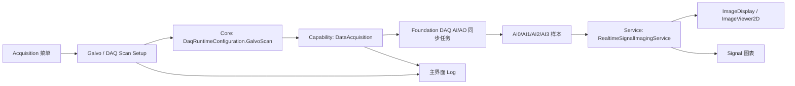

# 振镜 DAQ 扫描集成说明

## 目标

将 Foundation 测试工程中的 XY 振镜同步采集能力，按 MetaView 五层结构集成到平台中：

- 配置入口放在主程序菜单下。
- 图像输出到主界面的 `ImageDisplay`。
- 四路 AI 实时信号输出到主界面的 `Signal` 图表。
- 运行状态和错误信息输出到主界面的 `Log`。
- Presentation 不直接依赖 Foundation 测试工程界面，只通过 Core 配置、Capability 能力和 Service 服务协作。

## 分层关系



## 当前代码结构

### Core 层

文件：

- `E:\CodeX\New\MetaView\MetaView.Core\DataAcquisition\DaqRuntimeConfiguration.cs`

核心内容：

- `DaqRuntimeConfiguration`
  - `UseDemo`：是否使用 Demo 数据。
  - `ConfigurationPath`：兼容原有 DAQ JSON 配置路径。
  - `GalvoScan`：振镜扫描专用运行配置。
- `GalvoScanRuntimeConfiguration`
  - DAQ 类型、设备名。
  - AO X/Y 输出通道。
  - AI X/Y 位置反馈通道。
  - AI2/AI3 激光信号通道。
  - 图像尺寸、采样率、每像素采样点数、帧数。
  - 中心电压、扫描幅度、填充比例、回扫比例。
  - X 额外像素、反馈缩放、双向相位、探测器采样偏移、slew rate 限制。
  - 是否连续采集。
- `GalvoScanRuntimeMode`
  - `UnidirectionalRaster`：单向栅格扫描。
  - `BidirectionalRaster`：双向栅格扫描。
  - `FeedbackResample`：使用 X/Y 位置反馈进行重采样。
  - `XFeedbackRaster`：使用 X 反馈修正列位置，行方向按计划扫描。

### Capability 层

文件：

- `E:\CodeX\New\MetaView\MetaView.Capability.DaqAndPreprocessing\FoundationDataAcquisitionCapability.cs`
- `E:\CodeX\New\MetaView\MetaView.Capability.DaqAndPreprocessing\GalvoScan\GalvoScanWaveform.cs`
- `E:\CodeX\New\MetaView\MetaView.Capability.DaqAndPreprocessing\GalvoScan\GalvoScanWaveformGenerator.cs`

核心内容：

- 当 `GalvoScan.Enabled = true` 时，DAQ Capability 会按振镜扫描配置创建 AI/AO 同步任务。
- AO 任务输出两路波形：
  - `AO_X`：X 振镜控制。
  - `AO_Y`：Y 振镜控制。
- AI 任务采集四路信号：
  - `AI0_X`：X 位置反馈。
  - `AI1_Y`：Y 位置反馈。
  - `AI2_Laser`：激光信号 A。
  - `AI3_Laser`：激光信号 B。
- 配置阶段会先生成 X/Y AO 波形，并通过 Foundation DAQ 写入 AO 缓冲。
- AO 波形生成已对齐 XY Scan 测试工程的主要逻辑：
  - X extra pixels 会扩展命令行宽和 X 命令幅度。
  - 记录每条有效扫描线的 active 起点和长度。
  - 支持 ramp、turn、fill fraction、retrace ratio。
  - 支持 slew rate 检查和电压边界检查。
- 启动阶段调用 Foundation DAQ 的同步采集能力。
- 真实 DAQ 运行时，底层 AI/AO 任务采用连续任务模式，并重复输出一帧 AO 波形；上层根据 `Continuous` 和 `FrameCount` 决定是否主动停止。
- Stop 会停止 DAQ、解绑数据事件并释放 DAQ 实例，避免真实硬件任务继续占用设备。
- Foundation 返回的数据会转换成平台统一的 `DaqSamplePacket`，继续发布给 Service 层。

### Service 层

文件：

- `E:\CodeX\New\MetaView\MetaView.Services.Interfaces\IRealtimeSignalImagingService.cs`
- `E:\CodeX\New\MetaView\MetaView.Services\RealtimeSignalImagingService.cs`

核心内容：

- `SetGridSettings(ScanGridSettings settings)`：设置当前图像网格尺寸。
- `ProcessDemoFrame(...)`：生成 Demo 图像和四路信号，用于不接真实 DAQ 时验证链路。
- 实时 DAQ 数据到达后，使用 AI0/AI1 的 XY 位置反馈，将 AI2/AI3 的信号分组到图像网格。
- 当前 AI2/AI3 会先组合为探测器信号，再按当前 Galvo 扫描模式重建图像：
  - 计划栅格模式：按 AO 波形 line metadata 跳过 ramp/turn 和 X extra pixels。
  - 双向模式：支持反向行翻转和 bidirectional phase samples。
  - FeedbackResample：使用 AI0/AI1 实测位置做双线性重采样。
  - XFeedbackRaster：使用 AI0 修正列位置，行号按计划扫描顺序。
  - Detector offset samples 会用于补偿探测信号相对位置/命令的延迟。
- 网格内多个数据点会被聚合成一个像素值，并归一化为图像。
- 同一批数据同时发布到：
  - ImageDisplay。
  - Signal 图表。
  - 主界面 Log。

### Presentation 层

文件：

- `E:\CodeX\New\MetaView\MetaView.Presentation\ViewModels\GalvoDaqScanSetupViewModel.cs`
- `E:\CodeX\New\MetaView\MetaView.Presentation\Views\GalvoDaqScanSetupWindow.xaml`
- `E:\CodeX\New\MetaView\MetaView.Presentation\Views\GalvoDaqScanSetupWindow.xaml.cs`
- `E:\CodeX\New\MetaView\MetaView.Presentation\Views\TopBarView.xaml`
- `E:\CodeX\New\MetaView\MetaView.Presentation\Views\TopBarView.xaml.cs`

入口：

- 顶部菜单 `Acquisition -> Galvo / DAQ Scan Setup`。

配置窗口能力：

- 设置 DAQ 类型、设备名、端子模式。
- 设置 AO/AI 通道。
- 设置扫描模式、图像尺寸、采样率、每像素采样点、帧数。
- 设置 X/Y 中心电压和扫描幅度。
- 设置填充比例和回扫比例。
- 支持 Demo 预览。
- 支持真实 DAQ 运行和停止。
- 显示预计 AO 样本量和预计采集时间。
- 参数过大时会阻止启动，避免生成过大的 AO 波形导致内存或硬件任务异常。
- `Y Position Test` 诊断按钮暂未放入 MetaView 菜单窗口，避免出现界面入口存在但能力未接入的误导；该能力可作为后续独立诊断项补充。

### Composition 层

文件：

- `E:\CodeX\New\MetaView\MetaView\Composition\MetaViewContainerRegistration.cs`

核心内容：

- 注册 `GalvoDaqScanSetupViewModel`。
- 顶部菜单打开配置窗口时，从 Prism 容器取得同一个 ViewModel 实例。

## 默认通道约定

当前默认配置如下：

| 信号 | 默认通道 | 含义 |
| --- | --- | --- |
| AO X | `Dev1/ao0` | X 振镜控制电压 |
| AO Y | `Dev1/ao1` | Y 振镜控制电压 |
| AI X | `Dev1/ai0` | X 位置反馈 |
| AI Y | `Dev1/ai1` | Y 位置反馈 |
| AI2 | `Dev1/ai2` | 激光信号 A |
| AI3 | `Dev1/ai3` | 激光信号 B |

如果现场硬件通道不同，只需要在 `Galvo / DAQ Scan Setup` 窗口修改通道并点击 `Apply / Save`。

## 配置文件

配置文件位置：

```text
E:\CodeX\New\MetaView\config\metaview.devices.json
```

相关节点：

```json
{
  "daq": {
    "useDemo": true,
    "configurationPath": "",
    "galvoScan": {
      "enabled": true,
      "daqType": "NationalInstruments",
      "deviceName": "Dev1",
      "analogOutputXChannel": "Dev1/ao0",
      "analogOutputYChannel": "Dev1/ao1",
      "positionXInputChannel": "Dev1/ai0",
      "positionYInputChannel": "Dev1/ai1",
      "signalAInputChannel": "Dev1/ai2",
      "signalBInputChannel": "Dev1/ai3",
      "imageWidth": 100,
      "imageHeight": 100,
      "sampleRate": 20000,
      "samplesPerPixel": 2
    }
  }
}
```

`Apply / Save` 会把当前窗口中的 DAQ/Galvo 参数写回这个 JSON 文件。下次启动软件时，会继续加载最近一次保存的配置。

## 运行流程

### Demo 验证

1. 打开 `Acquisition -> Galvo / DAQ Scan Setup`。
2. 勾选 `Demo mode`。
3. 设置图像尺寸，例如 `100 x 100`。
4. 点击 `Demo Preview`。
5. 主界面应看到：
   - ImageDisplay 出现模拟图像。
   - Signal 图表出现四路模拟信号。
   - Log 输出 Demo 预览信息。

### 真实 DAQ 运行

1. 打开 `Galvo / DAQ Scan Setup`。
2. 取消勾选 `Demo mode`。
3. 设置真实 DAQ 类型、设备名和通道。
4. 设置图像尺寸、采样率、每像素采样点。
5. 确认预计样本量没有超过安全上限。
6. 点击 `Apply / Save` 保存配置。
7. 点击 `Run` 启动采集。
8. 图像、曲线和 Log 会回到主界面显示。
9. `Continuous` 勾选时会持续刷新，直到点击 `Stop`。
10. `Continuous` 未勾选时，会按 `FrameCount` 接收目标帧数，达到后主动停止 DAQ。

## 参数校验

窗口在 `Apply / Save` 和 `Run` 前会进行基础校验：

- 设备名不能为空。
- AO/AI 通道不能为空。
- 图像宽高必须大于等于 2。
- 帧数必须大于等于 1。
- 采样率必须大于 0。
- 每像素采样点必须大于等于 1。
- X/Y 扫描幅度必须大于 0。
- `Fill Fraction` 必须在 `(0, 1]` 范围内。
- `Retrace Ratio` 不能为负数。
- X/Y 扫描电压窗口必须保持在 `-10 V ~ +10 V` 范围内。
- 预计 AO 样本量不能超过 `10,000,000` 点。

校验失败时：

- 配置窗口状态显示 `Validation failed`。
- 主界面 Log 输出红色错误。
- 点击错误 Log 可以查看处理建议。

## 当前验证结果

已执行构建：

```powershell
dotnet build MetaView.slnx -m:1 -p:UseSharedCompilation=false -v:minimal
```

结果：

- 构建通过。
- 当前仍有既有警告：
  - `SkiaSharp.Views.WPF` 对 `net8.0-windows` 的兼容性提示。
  - `Thorlabs.Elliptec.ELLO_DLL` 未解析提示。

这些警告不是本次 Galvo/DAQ 集成新增的阻塞项。

## 后续建议

- 现场调试时先用低分辨率和低采样率，例如 `100 x 100`、`20000 Hz`、`2 samples/pixel`。
- 真实硬件稳定后，再逐步提高图像尺寸和采样率。
- 后续可以继续扩展信号合成方式，例如 AI2、AI3、AI2+AI3、AI2-AI3、AI2/AI3。
- 后续可以增加扫描配方，把 Galvo/DAQ 扫描纳入多模态 Workflow 的正式步骤。
